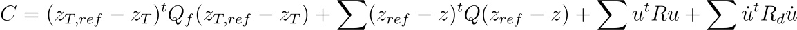

# Model Predictive Control
A linear model predictive controller for a robot operating under linear and
angular velocity and acceleration constraints.

**This code was originally derived from [PythonRobotics](https://github.com/AtsushiSakai/PythonRobotics/blob/master/PathTracking/model_predictive_speed_and_steer_control/model_predictive_speed_and_steer_control.py)**,
which I highly recommend as an educational resource and a repository of many
robotics algorithms in a variety of domains.

## Problem
[Model predictive control](https://en.wikipedia.org/wiki/Model_predictive_control)
is a popular method of constrained optimal control. In this case, we consider a
robot with a four-wheeled holonomic 'swerve' drivetrain operating in, for
example, a lunar environment, where low gravity enables wheel slippage, inducing
constraints on allowable acceleration.

Consider a four-wheeled robot with position given by (𝑥,𝑦), velocity 𝑣, yaw 𝜙
and angular velocity 𝜔, subject to input acceleration 𝑎 and angular acceleration
𝛼. We construct the state and input vectors


with the non-linear state-space model


We then seek to linearise this using a first order Taylor expansion about z bar and u bar


where the Jacobian of f with respect to z is


and the Jacobian of f with respect to u is


The future system state at discrete time step k+1 can be estimated using forward difference


where


Given some initial state `z0` and a desired 'reference' path, we seek the optimal inputs `u` to apply to the system that minimises the deviation from the reference path. This controller was applied as part of a larger path planning system with linearly interpolated paths, so in this project a straight-line reference path is used, although it can be arbitrary.

## Solution
For model predictive control, the system state for some inputs `u` is predicted
`T` time steps into the future, where `T` is known as the 'horizon length'.
At each time step, the linearisation point z bar is given by the non-linear
discrete-time prediction of the next state subject to the most recent inputs.
```
z_bar=z_k+f(z_k, u_k)*dt
```
Then for different inputs, at each time step the linearised discrete-time model is used to predict
the state of the system at the next time step.
The cost of the system subject to these inputs is as follows



where `z_T` is the furthest state prediction made into the future, `z_T,ref` is the closest point on the reference path to `z_T`, `Q`, `Q_f`, `R`, `R_f` are weight matrices and a raised `t` represents transposition. Summation is performed over each time step up to `T`.

We have constructed a quadratic programming problem for which a numerical solver can be used to find the inputs `u` to minimise the cost function. In this project, the Python library cvxpy is used for optimisation with OSQP as the optimiser.

A primary benefit of this approach to control is the ability to use constrained optimisation. In this project, constraints are placed on minimum and maximum linear and angular velocity (state variables) and acceleration (input variables).

An additional extension on this method is to iteratively update the state prediction using the optimal inputs found on a previous iteration and optimise, proceeding until the solutions are sufficiently constant up to a maximum number of iterations.

Much of this derivation was originally derived from the [MPC modelling](https://pythonrobotics.readthedocs.io/en/latest/modules/path_tracking.html#mpc-modeling) section of the PythonRobotics documentation.

## Implementation
A simple linearised model predictive controller is implemented in `model_predictive_controller.py`. It simulates a robot with a 'swerve' drivetrain, a holonomic drivetrain where the angle and speed of each wheel can be independently controlled. A derivation of the inverse kinematics can be found in `doc/swerve.pdf`.

When this was implemented, the cameras used for object detection were on the front of the robot, so necessarily the strafe input had to be set to 0 so the robot would always face in its direction of motion.

An example of the MPC simulation is below:


### Problems encountered during implementation
As humans, when considering angles (for example, looking at a unit circle) it is easy for us to see that the fastest way to travel from a heading of, for example, -170° to 170° is to rotate clockwise by 20°. However, an optimiser does not account for the discontinuity in the heading, instead recognising the fastest method to reach the desired heading to rotate counterclockwise 340° (i.e. the natural way to get from some number -170 to 170 is to add 340 to -170). This can result in suboptimal motion when the shortest path from the current heading of the robot to the desired heading crosses the negative x-axis. Here is an example from an older version:


In the case of a straight-line path, this 'looping' motion can be addressed by performing a transformation to convert the absolute heading of the robot 𝜙 to the angular difference between 𝜙 and the angle of the reference path 𝜙_0. This ensures that the shortest path to the goal heading never crosses the negative x-axis, so we will always turn in the optimum direction.

At the same time, we'll need to transform the reference path into this new frame. This is achieved by rotating each point in the reference path about the initial position (𝑥_0,𝑦_0) by -𝜙_0. This can be represented by the transformation


The angle 𝜙 is transformed according to


Velocities are invariant under the transformation so


With some manipulation we can write a transformation that acts on the whole state vector z:


This is an [affine transformation](https://en.wikipedia.org/wiki/Affine_transformation) which can be rewritten in the form


with inverse


(we are mainly interested in this for simulation purposes - for example transforming from the predicted states used by the MPC to the actual points in space)

An additional benefit is this allows very simple straight path generation. The original trajectory maps to the x-axis, so all y-points map to 0. Path generation is then a simple call to `linspace` or similar.

What happens when we apply this transformation to the initial state?


No more looping!
